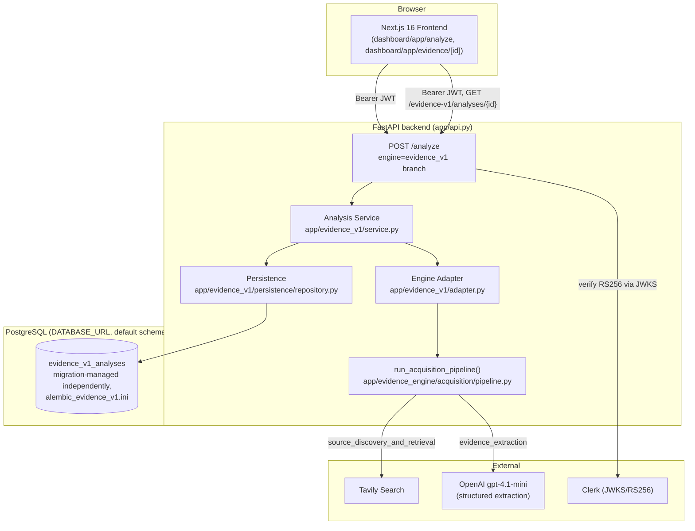
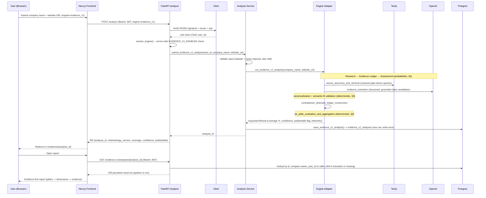

# Evidence Engine v1 — Production Architecture

**Added:** Task 33 (Evidence-v1 Product UX & Deployment Readiness), item 21. Companion to
`docs/architecture/EVIDENCE_ENGINE_PRODUCT_INTEGRATION.md` (the engineering-level integration record —
read that for the persistence/migration/feature-flag mechanics) and `docs/portfolio/ENGINE_TRANSPARENCY.md`
(the equivalent public-facing explanation for the **legacy** SIE pipeline). This document is the
portfolio-facing architecture reference for the **second, newer** analysis engine now live in the product
behind a server-side flag: what request a user actually triggers, which steps are AI-driven versus
deterministic, and why the boundary between those two kinds of steps is drawn where it is.

This describes a real, running path in this codebase (`EVIDENCE_V1_ENABLED` gated, reachable today via
`?engine=evidence_v1`), not a future plan.

## 1. Component architecture

Four layers, one direction of dependency: **Route → Analysis Service → Engine Adapter → Persistence**. The
route is thin (resolves which engine to use, delegates, maps errors to HTTP status codes); the Adapter is
the *only* place application code constructs real providers and calls the engine's own, independently
tested pipeline — no methodology logic is duplicated or reimplemented at the integration layer.

## 2. Request flow — what happens inside one analysis

The report page never re-runs acquisition — `GET /evidence-v1/analyses/{id}` is a pure read of the row
written once, at submission time, so opening a report later never re-incurs a provider cost or returns a
different answer than the one originally produced.

## 3. The probabilistic/deterministic boundary, and why it exists

Every step in §2 is one of exactly two kinds, and the engine never blurs the two together:

| Kind | Steps | Property |
|---|---|---|
| **Probabilistic (AI-driven)** | Search query execution (Tavily), evidence extraction (OpenAI structured output) | Same input can, in principle, produce different wording, a different set of retrieved pages, or a different proposed claim across two runs. Never assumed reproducible. |
| **Deterministic (plain code, no model call)** | Canonicalization, semantic-fit validation, contradiction detection, claim routing, pillar scoring/aggregation, Coverage/Confidence computation | Same validated input always produces the same output. No LLM is invoked anywhere in this column. |

This mirrors a rule already established elsewhere in this codebase for a *different* subsystem
(`docs/v2/ADR-0001-truth-model.md`'s AI-candidate/canonical-authority boundary for VentureGPS V2's company
identity resolution): **an AI call is only ever allowed to *propose*; a non-AI, reviewable rule decides
what is kept.** Evidence Engine v1 applies the same discipline to evidence, not company identity:

- An OpenAI extraction call proposes a **claim candidate** — a typed fact plus the exact, verbatim excerpt
  it was lifted from. It is never trusted as true on the model's say-so alone.
- Before a candidate becomes a `Claim` the ledger will ever score, **deterministic code** checks that the
  excerpt is actually present, verbatim, in the real retrieved source text (`extraction.py`'s grounding
  check); that its claimed category is semantically consistent with the typed fact it carries, not just
  schema-valid (`semantic_fit.py` — a schema-valid but semantically-wrong categorical value, e.g. a funding
  amount mislabeled as a hiring metric, is rejected, not scored); and that cross-claim identity
  (independence grouping, contradiction detection) is assigned from the fact itself, never from which model
  call happened to produce it.
- **Final pillar scores and the company-level Coverage/Confidence figures are pure Python arithmetic over
  already-validated claims** (`app/evidence_engine/scoring.py`, `cross_pillar_audit.py`) — no model call
  participates in turning validated evidence into a number. Two runs over the identical, already-ledgered
  evidence always produce the identical score.

**Why this boundary matters, stated plainly:** an LLM call producing the *same number twice* is not the
same claim as the LLM being *right*. The deterministic half of this pipeline guarantees the first property
(reproducibility of the scoring math); it deliberately does not, and cannot, guarantee the second
(correctness of what the AI proposed in the first place). The report accordingly separates "the evidence
the engine found and validated" from "the score computed from it" — a reader is never asked to trust an AI
judgment that was not first run through a deterministic, inspectable check.

## 4. What this integration deliberately does not do

- **No scoring methodology change.** `app/evidence_engine/`'s own scoring rules (pillar weights, Coverage/
  Confidence thresholds) are unmodified by this product-integration work — this document describes how an
  already-built, already-validated engine was wired into the real product, not a change to what it computes.
- **No replacement of the legacy engine.** The original SIE pipeline (`docs/portfolio/ENGINE_TRANSPARENCY.md`)
  remains the default, unflagged path for every user; Evidence Engine v1 is reachable only behind
  `EVIDENCE_V1_ENABLED` plus an explicit per-request opt-in, and nothing about the legacy path was removed,
  rewritten, or shared with this new one beyond already-existing, engine-agnostic infrastructure
  (authentication, cost/abuse protection, the underlying Postgres instance).
- **No automated staged rollout.** There is one global boolean flag, not a percentage rollout or per-user
  allowlist — see `DEPLOYMENT.md`'s "Evidence Engine v1 database migrations" section for the current, fully
  manual controlled-release procedure.
- **No company-identity integration with VentureGPS V2.** Evidence Engine v1 maintains its own lightweight
  company reference and does not resolve against V2's canonical `Company` records — an explicitly deferred
  decision (`docs/architecture/NEW_ENGINE_ARCHITECTURE.md` §1.3), not an oversight.
