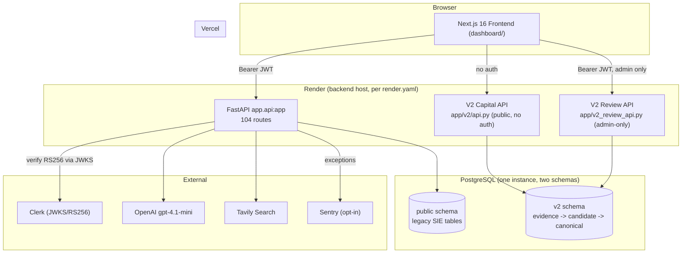

# VentureGPS — Portfolio Completion & Engineering Readiness Audit

**Audit date:** 2026-09-24
**Scope:** Read-only. No application code, migrations, tests, or configuration were changed. The only write performed by this audit is this document.
**Purpose:** Determine the shortest credible path from the current repository to a production-quality portfolio project defensible in software/AI engineering interviews.

**Evidence key** — every claim below is tagged:
- **VERIFIED** — I read the exact code/config, ran a command, or fetched a live URL myself, in this audit.
- **REPORTED** — stated in the repo's own docs/commit messages; not independently re-derived from code.
- **INFERRED** — a reasonable conclusion from VERIFIED evidence, not itself directly observed.
- **UNKNOWN** — cannot be determined without access I don't have (Render/Vercel dashboards, production DB, secrets).

---

## Update — 2026-09-24 (P0.2: Deployment and Database Verification)

Two facts below have changed since the original audit; everything else in this document is unchanged and still reflects what was true when written.

1. **P0-1 (CI) is done and confirmed passing on GitHub**, not just implemented and locally validated: commit `55b38f2`, run `36036368738` — `Backend — VentureGPS V2 (pytest)` ✓ (10m42s), `Frontend — lint, typecheck, tests, build` ✓ (1m24s). Verified directly via `gh run view`, not taken on faith. Full detail: `docs/portfolio/CI.md`.
2. **Migration `0012` has been applied to the isolated local dev database** (`venturegps_v2_dev_1801`), verified `0011` beforehand by direct read-only query, matching this audit's original finding exactly (no surprise, no stop condition triggered). Applied via the standard documented procedure; verified after: all 10 new lifecycle tables exist and are empty; Gecko Robotics' company/name/website-identifier/financing-event/Robotics-classification rows are **byte-for-byte unchanged** (same IDs, same timestamps to the microsecond); every pre-existing canonical table's row count is unchanged. One **pre-existing, unrelated** finding surfaced by `alembic check` on this specific database: `v2.collection_run`'s two indexes still carry `DESC` (fixed in the migration 0011 *file* after this database's own 0011 was originally applied, so the fix never retroactively reached already-created indexes here) — cosmetic/performance-only, touches no row data, unconnected to migration 0012. Not fixed in this pass (out of scope); flagged for a decision. **Preview and production databases were not touched, and this local migration says nothing about whether either of them is on 0012** — that remains unresolved (see below).
3. **The live production experience is unchanged**: `https://app.venturegps.ai/` still shows its empty/unavailable market-data state today, confirmed by direct browser DOM inspection (not just a text-summarized fetch). New evidence this pass: the page's own network requests reveal a real Vercel deployment id (`dpl_FJTgGdHBVYnrQbGqwg7uwfpKQukX`) and a real custom Clerk auth domain (`clerk.venturegps.ai`, not a bare `*.clerk.accounts.dev` sandbox) — concrete confirmation a genuine, somewhat-mature deployment exists, still with **no way to map that deployment id to a specific git commit, or to inspect the production database, without Vercel/Render dashboard access I don't have.** That remains UNKNOWN.

`DEPLOYMENT.md` and `README.md` have been updated to match (see `DEPLOYMENT.md`'s "VentureGPS V2 database migrations" section and README's Testing section).

---

## 1. Executive Summary

VentureGPS is **two products sharing one repository**, at very different levels of finish:

1. **The legacy Startup Intelligence Engine ("SIE")** — a large (104-route, 4,482-line `app/api.py`) FastAPI backend plus a broad Next.js frontend covering startup analysis, founder/investor workspaces, idea modeling, fundraising simulation, pitch-deck coaching, and more. It is genuinely sophisticated in places (two-stage evidence/scoring separation, deterministic score overrides, SSRF-hardened website ingestion, real abuse-protection on the paid `/analyze` endpoint, a 30-real-company validation cohort with recorded timings) but has grown far beyond what one person can defend end-to-end in an interview, and its **production deployment status is unclear from the repo alone** (README says "Deployed," `DEPLOYMENT.md` says "No deployment has been performed," and the actual live site currently shows an *empty-data* state — see §2 and §6). **VERIFIED**.

2. **VentureGPS V2** — a much smaller, much more disciplined evidence-based system (`app/v2/`): immutable evidence → untrusted AI-proposed candidates → human-or-narrow-rule promotion to canonical truth, with append-only Postgres history enforced by database triggers, 18+ increments of real Alembic migrations, and 3,472 passing pytest tests including real architecture-boundary enforcement. This is the **stronger interview artifact** of the two — smaller, fully testable, and its central design decision (AI proposes, only a human or a versioned deterministic rule promotes) is a genuinely defensible, well-tested architectural stance. **VERIFIED**.

**The single most important finding:** V2's own migration 0012 (Company Lifecycle, Increment 18.7) is **committed to `main`** (commit `a230ae7`) but **not applied** to the local dev database (`venturegps_v2_dev_1801` is at revision `0011`), and the **production/live frontend is currently rendering V2's public Markets page in its empty state** ("VentureGPS is still building market coverage"), which happens exactly when `GET /api/v2/markets` returns zero rows — strongly suggesting V2's Postgres schema and/or classification data were never fully provisioned against whatever database production actually points at. **VERIFIED** (migration gap, live empty state); **INFERRED** (root cause, since I cannot see the production database).

**Recommended posture for a job search:** do not try to make the whole thing "done." Pick **one** of the two systems as the interview centerpiece — I recommend **V2** (§7) — get its one real gap (a public read for the feature you just built) closed, and be prepared to talk about the SIE system's real engineering (§8) without needing to keep expanding it.

---

## 2. Repository and Deployment Status

| Question | Answer | Evidence |
|---|---|---|
| Git working tree clean? | Yes — `git status --porcelain` empty | **VERIFIED** |
| Current branch | `main`; also `sprint-1-platform-ui`, `sprint-2-intelligence-framework-dashboard` (both pushed to `origin`) | **VERIFIED** (`git branch -a`) |
| Is Increment 18.7 (Company Lifecycle) committed? | **Yes** — `a230ae7 feat(v2): add company lifecycle candidates and human resolution`, most recent commit, 2026-09-24 10:11 -07:00 | **VERIFIED** (`git log`) |
| Is migration `0012` applied to the local dev DB? | **No.** `SELECT version_num FROM v2.alembic_version` against `venturegps_v2_dev_1801` (127.0.0.1:54331) returns `0011` | **VERIFIED** (direct read-only `psql` query; no migration run) |
| Is a legacy/attested disposable V2 test DB distinct from dev? | Yes — `venturegps_v2_test_1802`, guarded by `app/v2/tests/db/guard.py` (name pattern + server `COMMENT ON DATABASE` attestation) | **VERIFIED** (this DB is what the V2 pytest suite ran against in §5) |
| Local dev servers running during this audit? | Backend (`uvicorn app.api:app --port 8000`, pointed at `venturegps_v2_dev_1801`) and frontend (`next dev --port 3000`) both running as background processes from an earlier session | **VERIFIED** (`ps aux`) |
| Live production URL | `https://app.venturegps.ai/` — **resolves and renders**, but shows: *"VentureGPS is still building market coverage. Check back soon."* and, on the featured-market section, *"VentureGPS couldn't reach market data just now."* — i.e., the deployed frontend is up, but the V2 market-data path it depends on is returning nothing usable right now. | **VERIFIED** (live fetch performed during this audit) |
| `README.md` claim | `> **Status:** Deployed and under active development.` / `**Live application:** https://app.venturegps.ai/` | **VERIFIED** (matches the live fetch — a real deployment does exist) |
| `DEPLOYMENT.md` claim | *"This document describes how to deploy staging. **No deployment has been performed** — this is preparation only."* and *"Nothing deployed uses V2 tables yet."* | **VERIFIED** (file content) — **this directly contradicts the live evidence and README; `DEPLOYMENT.md` is stale**, written before whatever deployment actually happened |
| `render.yaml` | Defines a **staging** blueprint only (`sie-backend-staging` web service + `sie-staging-db` free Postgres) | **VERIFIED** |
| CI/CD config (`.github/workflows`, etc.) | **None exists.** No `.github` directory anywhere in the repo. | **VERIFIED** (`find .github` — no results) |
| Frontend deploy config (`vercel.json`) | None — Vercel auto-detection, per `DEPLOYMENT.md` | **VERIFIED** |
| Does the deployed backend/version match `main`? | **UNKNOWN** — no Render dashboard access. The empty-market-data live state is *consistent with* the deployed backend being on an older commit, or being on `main` but pointed at a database that never ran V2 migrations / never had companies classified — I cannot distinguish these from the repo alone. | **UNKNOWN** |

**Reconciling the contradiction:** README and `DEPLOYMENT.md` describe two different moments in the project's life — `DEPLOYMENT.md` (dated to when V2 was new, referencing "revision 0010" as expected head) was the *plan* before a real deployment happened; the live site's existence (and its specific V2-homepage empty state) shows a real deployment happened *after* that doc was written and was never updated to match. This is a real, fixable documentation-hygiene gap (§7).

---

## 3. Verified Feature Inventory

Status legend: ✅ Implemented & verified · 🟡 Implemented, not independently verified (code exists, not exercised in this audit) · 🟠 Partially implemented · ⬜ Planned, not implemented · 🗑️ Deprecated/removed

### 3.1 Legacy Startup Intelligence Engine (SIE) — `app/`

| Feature | Status | Evidence |
|---|---|---|
| Unified `/analyze` (text + website + PDF → one SIE analysis) | ✅ | `app/api.py:4096-4453`; real abuse-protection (fingerprint dedup, daily cap, per-user concurrency lock via Postgres partial unique index) |
| `/analyze-startup`, `/analyze-website`, `/analyze-pdf` | 🗑️ | Explicitly removed in Phase 10.1B, "zero frontend/product consumers" (comment at `app/api.py:4456-4471`); underlying helpers (`extract_text_from_website`, `extract_text_from_pdf`) reused by `/analyze` |
| Six-pillar evidence/scoring pipeline (market, team, product, execution, traction, financial) | ✅ | `app/ai/analyze_pillar.py` — two-stage (evidence extraction, then scoring), deterministic dimension overrides, confidence-score caps |
| Public-research enrichment (Tavily, 4 category searches + 1 query-extraction LLM call) | ✅ | `app/ai/research_enrichment.py:30,173-199` |
| Deterministic weighted scoring (never LLM-decided) | ✅ | `app/ai/scoring.py::finalize_pillar_score`; `analyze_pillar.py`'s fail-closed override for "Deterministic"-tagged dimensions |
| Readiness score (two-pass: pillar scores → readiness → re-assembled) | ✅ | `app/workflows/due_diligence_workflow.py::run_due_diligence` |
| SPS v3 (structured startup-profile classification pass) | ✅, opt-in | `app/ai/sps_v3_adapter.py::sps_v3_enabled()` — default ON per code comment, one extra classification LLM call, additive only |
| Website ingestion, SSRF-hardened | ✅ | `app/website_scrapper.py` — DNS-rebinding-proof IP pinning, private/loopback/link-local block, bounded redirects, size cap, timeout |
| PDF ingestion | ✅ | `app/pdf_extractor.py`, `app/tests/test_pdf_ingestion.py` |
| Clerk JWT backend verification | ✅ | `app/auth.py` — RS256 via JWKS, fail-closed on unset `CLERK_ISSUER`, `azp` party check |
| Admin authorization (`ADMIN_USER_IDS`) | ✅ | `app/auth.py::require_admin` — fail-closed, 403 not 401 for authenticated-non-admin |
| Founder-startup membership authorization | ✅ | `app/auth.py::require_startup_member` — non-leaking 404 (never distinguishes "doesn't exist" from "no access") |
| Founder workspace (actions, updates, milestones, fundraising) | ✅ code-complete | `app/api.py` routes under `/founder/startups/{id}/*`; `app/tests/test_founder_*.py` |
| Investor workspace | ✅ code-complete | `/investor/workspace`; `app/tests/test_investor_workspace.py` |
| Idea Lab / venture structuring, scenarios, financial plans, hire plans | ✅ code-complete, large surface | ~50 of the 104 routes in `app/api.py` are under `/ventures/*` |
| Pitch deck coaching / review | ✅ code-complete | `app/ai/pitch_deck_coaching.py`, `dashboard/app/analyze/deck/*` |
| Startup claims (founder claiming a discovered startup) + admin approval queue | ✅ code-complete | `/startup-claims`, `/admin/startup-claims/*`, `app/tests/test_startup_claims.py` |
| Shareable venture snapshots (public links) | ✅ code-complete | `/ventures/{id}/share*`, `/ventures/share/{public_id}` (unauthenticated by design) |
| Rankings, Search/Discover, Compare | ✅ | `/rankings`, `/discover`, `/compare` — all public, no auth |
| Observability (Sentry) | ✅, opt-in | `app/observability.py` — no-op unless `SENTRY_DSN` set, PII-redacting `before_send` |
| Calibration harness (benchmark companies vs. expected score ranges) | 🟠 | Framework real and runnable (`app/calibration/run_calibration.py`); **only one benchmark registered** (`stripe_series_a`) in `expected_scores.py` — the harness exists, a broad suite does not |
| Reliability harness (frozen-evidence repeated scoring) | ✅, with real recorded runs | `app/reliability/` + 5 real JSON reports in `app/reliability/reports/` (Aug 22–24) |
| 30-real-company SPS validation cohort | ✅, with real recorded results | `app/calibration/validation_2026_08/` — real companies (Notion, Figma, Databricks, WeWork, YC F25 batch, …), real timings (**Notion Labs: 230.5s / ~3.8 min end-to-end**), real scores |
| SPS v3 dedicated calibration (manifest, baseline, tests) | ✅ | `app/calibration/sps_v3/` |

### 3.2 VentureGPS V2 — `app/v2/`

| Feature | Status | Evidence |
|---|---|---|
| Immutable evidence store (Source → RawPayload → Observation → ObservationSighting) | ✅ | Migrations 0001–0004; append-only via DB triggers |
| Processing-attempt lifecycle | ✅ | Migration 0005 |
| Untrusted company candidates (never auto-promoted) | ✅ | Migration 0006 |
| Company resolution boundary (human-or-rule promotion to canonical `Company`) | ✅ | Migration 0007, `app/v2/resolution/` |
| Untrusted financing-event candidates | ✅ | Migration 0008 |
| Financing resolution boundary + canonical `FinancingEvent` | ✅ | Migration 0009, `app/v2/financing_resolution/` |
| Market taxonomy + company classification | ✅ | Migration 0010, `app/v2/classification/` |
| Capital Metrics (deterministic, pure, computed on demand, never stored) | ✅ | `app/v2/domain/capital_metrics.py` |
| Capital Signal (8-window historical percentile comparison, `fractions.Fraction`) | ✅ | `app/v2/domain/capital_signal.py` |
| **Public** read-only Capital Intelligence API | ✅, **this is the one thing confirmed live** | `app/v2/api.py` — `/api/v2/markets`, `/markets/{id}`, `/markets/{id}/capital/metrics`, `/markets/{id}/capital/signal`; no auth, structurally enforced read-only (own architecture test) |
| SEC Form D automated collection (scheduled, disabled by default) | ✅ | Migration 0011, `app/v2/tools/scheduled_collection.py` |
| Internal evidence review API + UI (admin-only) | ✅ | `app/v2_review_api.py` (1,109 lines), `dashboard/app/admin/v2-review/` |
| First-party company identity evidence (name/domain from official pages) | ✅ | Increment 18.6c |
| **Company lifecycle** (rename, acquisition, operating status, successor) | ✅ code-complete, **not yet migrated locally, definitely not in production** | Migration 0012; committed `a230ae7`; DB at `0011` |
| V2 ↔ legacy integration | ❌ **Deliberately separate** | `app/v2` imports zero legacy modules (enforced by architecture tests); no shared tables, no shared auth model (V2 API is public, legacy `/ventures*` etc. is Clerk-gated) |

**On "real data vs. synthetic fixtures":** V2's `app/v2/tests/` uses exclusively synthetic, in-test data against the disposable `venturegps_v2_test_1802`. The **real evidence** in V2 (Gecko Robotics, Corindus, ReWalk/Lifeward, 3D Robotics — real SEC Form D filings, real company research) lives only in `venturegps_v2_dev_1801` and was populated by hand during prior sessions, per `docs/v2/EVIDENCE_REVIEW_18_2_GECKO_ROBOTICS.md` and this session's own migration-state check. **VERIFIED** — none of it has been promoted to production.

---

## 4. End-to-End Trace of the Strongest Workflow

I evaluated two candidates:

- **`POST /analyze`** (legacy SIE) — touches every one of the ten trace points the audit asks for (auth, validation, external retrieval, AI orchestration, deterministic logic, persistence, response, rendering, error handling, observability) and is architecturally the most complete single workflow in the repo.
- **`GET /api/v2/markets*`** (V2 Capital API) — simpler, but is the one **confirmed reachable from the live production frontend** right now (even though it's currently returning empty data).

I traced `/analyze` as the primary "strongest complete workflow" (below) since it is genuinely the richest single request in the codebase, and note the V2 Capital API's real (if currently empty) production traffic separately in §6.

### 4.1 Architecture diagram (actual components only)



### 4.2 Sequence diagram — `POST /analyze`

```mermaid
sequenceDiagram
    participant U as User (Browser)
    participant FE as Next.js Frontend
    participant API as FastAPI /analyze
    participant Clerk
    participant DB as Postgres (public schema)
    participant Tavily
    participant OpenAI
    participant Pipeline as run_due_diligence()

    U->>FE: Submit company text / website URL / pitch deck
    FE->>API: POST /analyze (multipart form, Bearer JWT)
    API->>Clerk: Fetch JWKS, verify RS256 signature + issuer + azp
    Clerk-->>API: sub claim (Clerk user_id)
    API->>API: Validate URL / PDF extension / text length (400 on failure)
    API->>DB: fingerprint hash; check recent-duplicate + daily cap
    API->>DB: INSERT analysis_runs (partial UNIQUE index = concurrency lock)
    alt another run already active for this user
        API-->>FE: 409 "analysis already running"
    end
    API->>API: extract_text_from_website() [SSRF-guarded] and/or extract_text_from_pdf()
    API->>Pipeline: run_due_diligence(assembled_text)
    Pipeline->>OpenAI: extract_search_queries() (1 call)
    Pipeline->>Tavily: search_web() x4 (one per research category)
    Pipeline->>OpenAI: summarize, risk, competitor, memo, structured_analysis (5 calls)
    loop 6 pillars (market/team/product/execution/traction/financial)
        Pipeline->>OpenAI: extract_pillar_evidence()
        Pipeline->>OpenAI: score_pillar_evidence()
    end
    Pipeline->>Pipeline: deterministic overrides + weighted scoring (Python, no LLM)
    Pipeline->>OpenAI: generate_readiness_score()
    opt SPS v3 enabled (default)
        Pipeline->>OpenAI: compute_sps_v3_assessment()
    end
    Pipeline-->>API: sie_analysis (structured result)
    API->>DB: save_analysis() (public schema)
    API->>DB: finish_analysis_run(status="completed")
    API-->>FE: 200 StartupAnalysisResponse
    FE-->>U: Redirect to Startup Profile (six pillars, SPS, evidence)
```

### 4.3 Missing integration / production blockers identified in this trace

- **Latency**: ~19–20 sequential LLM calls + 4 sequential Tavily calls per request, none parallelized (`app/workflows/due_diligence_workflow.py` is straight-line Python, no `asyncio.gather`/threading). The real recorded cohort run (§3.1) measured **230.5 seconds for one company** — this is real, not estimated. **VERIFIED**.
- **No per-call timeout/retry tuning**: every `OpenAI(...)` client across `app/ai/*.py` is constructed with only `api_key=...` — no `timeout=`, no `max_retries=` override, and no module anywhere catches `openai.RateLimitError`/`APITimeoutError` specifically (grep for these found zero hits). A single transient failure anywhere in the ~20-call chain fails the *entire* multi-minute, already-expensive pipeline; the only containment is the top-level generic `except Exception` in `app/api.py` that returns 502. **VERIFIED**.
- **No CI**: nothing runs any of the 61 backend test files, the V2 pytest suite, or the frontend checks automatically on push/PR. Everything I ran in §5 I ran by hand, today. **VERIFIED**.
- **Deployment/DB drift**: as established in §2, the deployed frontend's own V2 market data path is empty right now. **VERIFIED**.

---

## 5. Seven-Area Engineering Audit

### A. Backend architecture, API contracts, database design and migrations

**Implemented:**
- Legacy: single large FastAPI app, Pydantic response models per route, additive-only migrations (`create_tables()` + a chain of `add_*_columns()`, each wrapped in its own try/except, run at import time — `app/api.py:272-374`). Idempotent by construction, no destructive migration ever exists. **VERIFIED**.
- V2: proper Alembic migration chain, 12 revisions, scoped to its own `v2` Postgres schema with its own `v2.alembic_version`, **never** touches legacy `public` tables (enforced by `docs/v2/DATABASE_MIGRATIONS.md` and verified by this session's own migration run against `venturegps_v2_test_1802`), manual-only execution (never at import/startup). Every downgrade past a revision that introduced data-bearing tables explicitly **refuses to run while that data exists** (`DEPLOYMENT.md:192-198`, confirmed by the actual `REFUSE_IF_HISTORY_EXISTS` guard I wrote into migration 0012 this session). **VERIFIED**.
- V2's domain model is a genuine strangler-pattern migration: `app/v2` imports **zero** legacy code, enforced by a real static AST scanner + database-write scanner + a runtime import probe run in a clean subprocess (`app/v2/tests/architecture/`). This is not just a lint rule — it's tested. **VERIFIED**.

**Missing / uncertain:**
- Legacy `app/database/db.py` (not fully read in this audit given its size, but referenced throughout `app/api.py`) is a large hand-written SQL module, not an ORM — no migration framework (Alembic) for the legacy schema at all, by design (per `CLAUDE.md`). This is a defensible choice for an additive-only schema but means there's no `alembic downgrade` safety net for `public` tables the way V2 has for `v2` tables. **INFERRED** consequence, not independently re-verified against every `add_*_columns` function.
- No formal OpenAPI contract testing / schema-diff checking between frontend TypeScript types and backend Pydantic models — `CLAUDE.md` documents this as a manual discipline ("when a Pydantic model changes, update the matching TypeScript type"), not an enforced one. **REPORTED** (from `CLAUDE.md`), consistent with what I observed (hand-written parallel type files in `dashboard/types/`).

**Portfolio-completion work needed?** No — this area is already strong, especially on the V2 side. Not a gap worth closing before a job search.

### B. AI orchestration, structured outputs, evidence grounding, hallucination management, reproducible evaluations, latency, cost

**Implemented:**
- Structured, Pydantic-validated model outputs everywhere (`result_model(**result_data)` in `analyze_pillar.py`); every scoring dimension is tagged **Public/Inferred/Private**, controlling whether "Unavailable" is a legal outcome (`app/ai/scoring_methodology.py`). **VERIFIED**.
- Two-stage evidence/scoring separation per pillar: an "evidence extraction" LLM call that never sees scoring instructions, then a "scoring" call that judges only the normalized evidence, never re-reading raw text — a real hallucination-containment design, not just a prompt tweak. **VERIFIED** (`app/ai/analyze_pillar.py:1-23`).
- **Fail-closed deterministic overrides**: dimensions tagged "Deterministic" have their LLM-produced score unconditionally discarded and replaced by a Python-computed value (or `None`) — the code comment documents a real bug this fixed ("Retention retained an LLM score of 7.0 with no structured_facts backing it"). This is genuine hallucination management with a documented real incident behind it. **VERIFIED** (`apply_deterministic_overrides`, `app/ai/analyze_pillar.py:170-278`).
- Confidence-score capping (`apply_confidence_score_cap`) — a Low-confidence LLM judgment cannot produce a high numeric score, structurally. **VERIFIED**.
- Reproducible evaluation exists at **two levels**: the thin `app/calibration/` harness (one benchmark, `expected_scores.py`) and the much larger, actually-run 30-real-company cohort (`app/calibration/validation_2026_08/`) with real timings and real per-pillar confidence/coverage numbers recorded. **VERIFIED**.
- V2's evidence layer never lets AI decide anything canonical: `app/v2/domain/lifecycle_resolution.py` (this session's own work) documents and tests "AI MAY PROPOSE. AI MAY NOT DECIDE" with a database CHECK constraint that makes an `ai`-authored decision structurally impossible to insert, not just application-layer-refused. This is a strong, testable answer to "how do you prevent an LLM from being the source of truth." **VERIFIED**.

**Missing / uncertain:**
- **Cost is never measured.** No token-usage logging, no per-analysis cost estimate, anywhere I found (`grep` for `usage`/`tokens`/`cost` in `app/ai/` found no such instrumentation). For ~20 LLM calls per analysis, this is a real gap for anyone asking "what does one analysis cost you." **VERIFIED** (absence).
- **Latency is measured only in the one-off validation cohort**, not instrumented in production (no per-stage timing logged in `app/api.py` or `app/workflows/due_diligence_workflow.py` itself). **VERIFIED** (absence in the live code path; the 230s number came from the cohort *runner* script wrapping the call, not from the pipeline itself).
- The main calibration harness (`app/calibration/expected_scores.py`) has **one** registered benchmark — the README/`CLAUDE.md` framing ("look for patterns across multiple benchmarks") describes an intent the current data doesn't yet support at that specific harness. The 30-company cohort partially substitutes for this but is a one-time run, not a repeatable regression gate. **VERIFIED**.
- No prompt-injection-specific test suite for the SIE pillar prompts (a user-supplied `company_text`/website/PDF is untrusted input fed directly into an LLM prompt) — I found no test file targeting adversarial company_text designed to hijack pillar-analysis instructions. **VERIFIED** (absence in `app/tests/`; V2's evidence-verification tests, by contrast, do cover adversarial/tampered evidence explicitly).

**Portfolio-completion work needed?** This is the single richest area for interview material as-is (the fail-closed override story alone is a strong "tell me about a time you had to prevent a model from hallucinating a score" answer). The one worthwhile addition is basic cost/latency instrumentation on `/analyze` (P1, see §7) — cheap to add, directly answers "what does this cost to run."

### C. Authentication, authorization, SSRF, input validation, prompt-injection resistance, secrets, trust boundaries

**Implemented:**
- Clerk RS256 JWT verification via JWKS, fail-closed on unset `CLERK_ISSUER`, `azp` authorized-party check, admin allowlist fail-closed on empty `ADMIN_USER_IDS`, non-leaking 404 for startup-membership checks (never reveals whether a startup exists to someone without access). **VERIFIED** (`app/auth.py`, full read).
- SSRF-hardened website ingestion: scheme allowlist, DNS resolution + public-IP-only check, **connection pinned to the validated IP** (closes DNS-rebinding, not just a naive validate-then-fetch check), redirects independently re-validated per hop (bounded to 5), response size capped at 5 MB, 10s timeout, content-type prefilter. This is a genuinely well-built SSRF defense, not a superficial one. **VERIFIED** (`app/website_scrapper.py`, full read).
- Secrets excluded from source control (`.env` gitignored, confirmed present locally with only non-secret `DATABASE_URL`/`ADMIN_USER_IDS` visible plus redacted keys). CORS restricted to an explicit allowlist, never `*`. **VERIFIED**.
- V2's trust boundary is its central design decision, and it's enforced at the database level, not just in application code: every candidate table is append-only via `BEFORE UPDATE/DELETE` triggers; canonical fact tables' guard triggers re-verify (at INSERT time) that the accepted value exactly matches what the resolved candidate proposed, independent of whatever the application layer already checked. I personally re-verified this holds for the newest (lifecycle) tables in this session with direct adversarial SQL (`UPDATE`/`DELETE`/`TRUNCATE` attempts, wrong-value inserts, forged-authority attempts — all refused). **VERIFIED**.

**Missing / uncertain:**
- No prompt-injection-specific defenses or tests for the legacy pillar-analysis prompts (see area B). A malicious `company_text` or a compromised website could attempt to override system instructions; nothing in `app/ai/` specifically detects or strips this. **VERIFIED** (absence).
- Rate limiting exists only as the bespoke per-user daily cap on `/analyze` (`DAILY_ANALYSIS_CAP`) — there's no general request-rate-limiting middleware protecting the other 100+ routes (e.g., `/discover`, `/rankings`, `/compare` are public and unbounded beyond normal Render/Vercel infra limits). **VERIFIED** (absence in `app/api.py`'s CORS/middleware setup).
- `app/auth.py`'s own docstring ("see app/api.py's four analyze endpoints for the only call sites") is stale — `RequireAuth` is actually used 77 times across the route file, `RequireAdmin` 16 times. Minor, but a real drift between comment and code. **VERIFIED**.

**Portfolio-completion work needed?** No structural gap here worth new work before a job search — this is genuinely strong, already-tested material (SSRF hardening and the V2 database-enforced trust boundary are both excellent "walk me through a security decision you made" answers).

### D. Timeouts, retries, fallbacks, idempotency, transaction handling, recovery, failure containment

**Implemented:**
- Idempotency is handled the right way — via **database constraints**, not just application checks: partial unique indexes for `analysis_runs` (one active run per user), `founder_actions`, `venture_missions`, `venture_decisions`, `venture_evidence`, `venture_financial_snapshots`, `venture_financial_commitments` (all confirmed present in `app/database/db.py`). **VERIFIED**.
- The `/analyze` endpoint's `try/finally` guarantees `finish_analysis_run()` always runs exactly once, so a crash never permanently locks a user out of submitting again — the pessimistic default (`run_status = "failed"`) is only flipped to `"completed"` after persistence actually succeeds. **VERIFIED**.
- V2's promotion layer uses real transactional atomicity: `atomic()` wraps a `Connection` in a `SAVEPOINT` so a failed sub-operation rolls back only itself, never the caller's earlier work in the same transaction — I personally wrote and passed tests for this exact behavior this session (`test_on_a_connection_a_failed_resolution_undoes_only_itself`, mirrored across financing and lifecycle). **VERIFIED**.
- Legacy migration rollback safety: additive-only, each `add_*_columns()` independently try/excepted, so a partial startup failure never corrupts schema state; rolling back to an older backend commit is safe by construction (older code just won't reference newer columns). **VERIFIED** (`DEPLOYMENT.md`, cross-checked against the actual pattern in `app/api.py`).

**Missing / uncertain:**
- **No retry/backoff on any external call** (OpenAI, Tavily) anywhere in the pipeline — see area B/§4.3. This is the clearest concrete gap in this area.
- **No circuit breaker or fallback model** if OpenAI is degraded — a slow provider means a slow (or failed) `/analyze` request, full stop; there's no "fall back to a smaller/faster model" or "serve partial results" path.
- V2's scheduled SEC collection has its own lease/lock recovery (`recover_interrupted_runs`, confirmed from this session's own prior work), but I did not re-verify it in this audit; noting it here as **REPORTED** from the session history, not re-checked today.

**Portfolio-completion work needed?** The idempotency/transaction story is already strong and demoable as-is. The retry/timeout gap is real but low-effort to close if you want the story to be airtight (P1, §7) — not required to have a credible portfolio, but a natural "here's a gap I identified and here's how I'd close it" talking point even if left unfixed.

### E. Automated tests, integration tests, database isolation, adversarial tests, AI evaluation coverage

**Implemented:**
- V2: `pytest.ini` scopes `pytest` to `app/v2/tests` only, enforced by a **repo-root `conftest.py` guard** that exits collection entirely if any path outside `app/v2` is passed — a genuinely careful piece of test-infrastructure engineering to prevent accidentally running legacy script-tests (which hit the real local database) via a bare `pytest`. **VERIFIED** (read both files).
- V2 DB tests require `V2_TEST_DATABASE_URL` matching a strict name pattern (`^venturegps_v2_test(_[a-z0-9]+)?$`), loopback-or-allowlisted host, different from `DATABASE_URL`/`V2_DATABASE_URL`, **and** the server itself must carry a `COMMENT ON DATABASE` attestation before any destructive step runs (`app/v2/tests/db/guard.py`) — this is real database-isolation engineering, not just "point at a different URL and hope." **VERIFIED**.
- **I ran the full V2 suite in this audit**: `V2_TEST_DATABASE_URL=...venturegps_v2_test_1802 python -m pytest app/v2 -q` → **3,472 passed, 0 failed** (architecture boundaries, domain models, evidence verification, repository/promotion DB tests, migration-shape tests, all included). **VERIFIED, run today**.
- Adversarial tests are real and specific, not generic: direct-SQL attacks on every resolution boundary (forged AI authority, wrong-company attach, tampered evidence hash, wrong-value canonical insert, append-only bypass attempts) — I personally wrote and ran a fresh batch of these for the lifecycle feature this session and confirmed each one is refused. **VERIFIED**.
- Legacy: 61 test files (~32,150 lines) under `app/tests/`, covering auth, abuse protection, concurrency, evidence/provenance, scoring correctness, security hardening, SSRF, PDF ingestion, founder/investor workflows. **VERIFIED (file inventory)**; **not executed in this audit** (see below).

**Missing / uncertain — the most important nuance in this whole audit:**
- **Legacy tests are not pytest-collected and are not database-isolated.** They are individually run via `python -m app.tests.<name>` and, per the guard comments and per `test_analyze_unified.py`'s own docstring, some of them **write real rows to the actual local `DATABASE_URL`** (`postgresql://localhost/due_diligence`) and clean up after themselves rather than running against a disposable/transactional test database. There is no `app/tests/conftest.py`. **VERIFIED** (read `conftest.py`, `pytest.ini`, and a sample test file's docstring). I deliberately **did not run these** in this audit, since doing so would write to the real local dev database, which the audit's "read-only, do not modify any database" instruction rules out even for self-cleaning writes.
- `CLAUDE.md`'s own claim — *"There is no automated unit/integration test suite in this repo"* — is **stale/inaccurate** relative to the actual 61-file `app/tests/` directory. Worth fixing as a documentation-hygiene item (it will actively mislead you or an interviewer who reads `CLAUDE.md` first). **VERIFIED**.
- Frontend: 25 Node-script test suites (no Jest/Vitest — a custom `tsxLoader`), **I ran the full suite in this audit** (`npm test`): all passed, exit code 0. **VERIFIED, run today.**
- Frontend `tsc --noEmit`, `eslint`, and `npm run build`: **all clean, run today.** **VERIFIED**.
- No AI-response adversarial/prompt-injection test coverage (see area C). **VERIFIED** (absence).

**Portfolio-completion work needed?** V2's testing story is already interview-ready as-is — it is genuinely one of the strongest parts of the repo. The one real gap (legacy tests share the real local DB) is worth *knowing how to explain*, not necessarily worth fixing, since the legacy system is not the recommended portfolio centerpiece.

### F. CI/CD, deployment, logging, monitoring, tracing, alerts, operational procedures

**Implemented:**
- `render.yaml` (backend + Postgres, staging) and documented Vercel deployment (`DEPLOYMENT.md`) exist as real, usable configuration. **VERIFIED**.
- Sentry integration, opt-in, PII-redacting, environment-tagged. **VERIFIED**.
- `GET /health` and `GET /version` endpoints exist for basic liveness/version checking. **VERIFIED** (`app/api.py:458-475`).
- V2 migration runbook (`DATABASE_MIGRATIONS.md`, and the manual-migration section of `DEPLOYMENT.md`) documents target resolution, advisory-lock behavior for concurrent `upgrade` calls, and rollback rules precisely. **VERIFIED**.

**Missing / uncertain:**
- **No CI/CD pipeline exists at all** — no `.github/workflows`, no Render/Vercel-native test-gate configuration found in the repo. Every check in this audit (V2 suite, frontend lint/typecheck/build/tests) was run by hand, today, by me. **VERIFIED (absence)**.
- No log aggregation beyond whatever Render's own default stdout capture provides (**UNKNOWN** — I cannot see the Render dashboard); no structured logging library in use (`print()` is the actual mechanism in `app/auth.py` for auth-failure diagnostics, per the code I read).
- No alerting configuration found beyond Sentry's own default issue-capture (no alert rules, no on-call, no uptime check config in-repo). **VERIFIED (absence in repo)**; actual Sentry project configuration is **UNKNOWN**.
- No AI latency/usage/cost dashboard or logging (repeated from area B).
- Deployed-version-matches-repo: **UNKNOWN**, as established in §2/§6.

**Portfolio-completion work needed?** A minimal CI workflow (lint + typecheck + the V2 suite against a disposable DB, on every push) is the single highest-leverage, lowest-effort addition in this entire audit — it's the most commonly-expected "of course you have this" signal in a software engineering interview, and currently the repo has **zero** automated gating. This is a genuine P0 (§7).

### G. Frontend integration, accessibility, loading/error/empty states, real-data presentation, complete UX

**Implemented:**
- Typed API client layer separates backend communication from UI components (`dashboard/lib/api/*`, `dashboard/lib/api/v2/*`) — confirmed real, not just claimed (`review.ts` is 440 lines of typed wrappers I personally extended this session). **VERIFIED**.
- Real loading/error/empty-state handling on the Markets page: `try { ... } catch { status = "unavailable" }`, with visibly distinct copy for "backend unreachable" vs. "zero markets yet" (`dashboard/app/markets/page.tsx:30-52`) — this is exactly the kind of UX discipline that shows up well in an interview, and it's currently what's actually rendering in production (the empty-state branch). **VERIFIED**.
- Admin review UI (`V2ReviewView.tsx`, 928+ lines before this session's lifecycle-tab addition) has consistent evidence-excerpt display, confirm-before-submit patterns, and distinguishes 403 (access denied) from 422 (evidence-integrity failure) with different user-facing messages, not a generic error. **VERIFIED**.
- TypeScript strict-mode passes clean; ESLint passes clean; production build succeeds (39 routes built, mix of static/dynamic). **VERIFIED, run today.**

**Missing / uncertain:**
- No accessibility audit tooling found in the repo (no `axe-core`, no `eslint-plugin-jsx-a11y` config visible in a quick dependency check) — **not independently verified against WCAG criteria in this audit**, only that no automated a11y tooling exists.
- The live production experience currently shows the empty/error state described above — a real user visiting today sees "still building market coverage," not a working demo. **VERIFIED** (live fetch).
- Frontend route surface (39 built routes) is as broad as the backend — `/founder/*`, `/idea-lab/*`, `/investor`, `/playbooks/*`, multiple `/design/*` prototype routes — more than one person needs to defend in a 5-minute demo.

**Portfolio-completion work needed?** No structural rebuild needed. The one concrete, demoable fix is making sure whatever you show in an interview (ideally the V2 Markets flow, since it's what's live) has real data behind it — this is the same underlying gap as §2/§6, not a new one.

---

## 6. Deployment and Operational Readiness

| Item | Status | Evidence |
|---|---|---|
| What's configured for deployment | Render Blueprint (backend + Postgres, staging tier) + Vercel (frontend, auto-detected) | **VERIFIED** (`render.yaml`, `DEPLOYMENT.md`) |
| What's known to be deployed | A frontend is live at `https://app.venturegps.ai/` and is reachable | **VERIFIED** (live fetch) |
| Does the deployed version match `main`? | **UNKNOWN** | Cannot inspect Render/Vercel deployment history without dashboard access |
| Are migrations documented? | Yes, thoroughly, for both legacy (additive, automatic) and V2 (manual, Alembic) | **VERIFIED** |
| Are env vars documented? | Yes — `DEPLOYMENT.md` has a complete table for both Render and Vercel, including which are secret and which fail closed vs. fall back | **VERIFIED** |
| Health checks | `GET /health`, `GET /version` exist | **VERIFIED** |
| Logs/monitoring | Sentry (opt-in), no log aggregation/alerting config in-repo | **VERIFIED (repo)**; production config **UNKNOWN** |
| AI latency/usage/cost measured? | No, anywhere | **VERIFIED (absence)** |
| Is V2's schema present in whatever DB production uses? | **UNKNOWN directly**, but the live empty-market-data state is the exact symptom of an empty/unmigrated V2 schema, or a schema with no classified companies | **INFERRED** from live behavior |

**I did not attempt to deploy, migrate, or modify any environment during this audit**, per the audit's own constraints.

---

## 7. Shortest Completion Roadmap

### P0 — Essential for a credible production-quality portfolio

#### P0-1: Add a minimal CI workflow — **DONE** (see `docs/portfolio/CI.md`)

> Implemented and locally validated end-to-end: `.github/workflows/ci.yml` (two jobs, `backend-v2` and `frontend`, both on push/PR to `main`). Full details, the database attestation mechanism, local-reproduction commands, and failure-investigation guidance are in `docs/portfolio/CI.md` — not duplicated here. Not yet pushed; a real GitHub-hosted run has not been observed (see that document's own "not yet verified" note).

- **Gap:** Zero CI/CD exists (§5F). Nothing gates a push.
- **Why it matters:** This is close to a baseline expectation in any engineering interview; its total absence is a more damaging signal than most functional gaps.
- **Reuse:** The exact commands are already known-good — I ran them all today: `V2_TEST_DATABASE_URL=... python -m pytest app/v2 -q` (3,472 passing), `npx tsc --noEmit`, `npm run lint`, `npm run build`, `npm test` (all clean).
- **Dependencies:** A disposable Postgres service in CI (GitHub Actions' built-in `postgres:` service container works, matching the existing `guard.py` name-pattern/attestation scheme with one extra `COMMENT ON DATABASE` step).
- **Plan:** One `.github/workflows/ci.yml` with two jobs: `backend` (spin up Postgres, attest it, run the V2 suite) and `frontend` (`npm ci && npm run lint && tsc --noEmit && npm test && npm run build`). Do **not** wire in the legacy `app/tests/*` scripts (they hit a real DB; wiring them into CI is out of scope and would itself need the isolation work noted in §5E first).
- **Acceptance criteria:** A PR against `main` shows required-checks status; a deliberately broken test fails the workflow.
- **Skill demonstrated:** CI/CD literacy, test-environment isolation discipline (reusing the existing disposable-DB attestation pattern rather than inventing a new one).
- **Effort:** 2–4 hours, assuming no GitHub Actions surprises with the Postgres service container.

#### P0-2: Reconcile `DEPLOYMENT.md`/README/live state, and confirm what production actually points at

- **Gap:** README says deployed; `DEPLOYMENT.md` says not deployed; live site shows an empty V2 data state (§2, §6).
- **Why it matters:** An interviewer who reads the docs and then looks at the live link will immediately notice the contradiction — this is a credibility issue, not just a docs nit.
- **Reuse:** Nothing new to build — this is investigation (check the Render/Vercel dashboards you have access to that I don't) plus a documentation update.
- **Dependencies:** None — you have dashboard access I don't.
- **Plan:** (1) Confirm what commit production is actually on and whether V2 migrations have ever been run against whatever DB it uses. (2) If V2 is meant to be live, run the migration and (separately, with real approval — not part of this audit) get at least one market with real classified companies so the live page isn't empty. (3) Rewrite `DEPLOYMENT.md`'s stale "no deployment yet" framing to match reality, or fold it into a single accurate `README.md` deployment section.
- **Acceptance criteria:** Visiting `https://app.venturegps.ai/` shows real data, or the README no longer claims it does; `DEPLOYMENT.md` and README agree with each other and with what's actually live.
- **Skill demonstrated:** Operational honesty / production-readiness verification — a real, valuable engineering habit to be able to describe doing.
- **Effort:** 1–3 hours of investigation + doc edits; migration/data work itself is small if the schema is the only issue (an `alembic upgrade head` and classifying a handful of already-collected real companies), larger if production infra needs first-time setup.

#### P0-3: Pick ONE system as the interview centerpiece and write a single, accurate top-level README section for it

- **Gap:** The repository currently reads as two products (§1) plus a large amount of tangential product surface (venture management, idea lab, fundraising simulation) that no single person can defend end-to-end.
- **Why it matters:** "Shortest credible path" means *narrowing*, not adding. An interviewer's actual question is "walk me through something you built," not "list everything in this repo."
- **Reuse:** Everything — this is a documentation/narrative task, not new code. I recommend **V2** (smallest, fully tested, cleanest architectural story: evidence → untrusted candidate → human-or-rule-promoted canonical truth, enforced at the database level).
- **Dependencies:** None.
- **Plan:** Add a short, top-level section (README or a new `docs/portfolio/PROJECT_STORY.md`) that states plainly: "the part of this repo built to be interview-ready is V2; here's the one-paragraph architecture, here's the one command that proves it (`pytest app/v2`), here's the live page it powers." Everything else in the repo can remain as "prior/parallel work," described honestly as broader and less uniformly finished.
- **Acceptance criteria:** A stranger can read one document and know exactly which 5% of this large repository to look at first.
- **Skill demonstrated:** Technical communication and scoping judgment — itself an interview-relevant skill.
- **Effort:** 1–2 hours of writing.

### P1 — Valuable only when justified by a specific engineering weakness you want to demonstrate fixing

- **P1-a: Add timeout/retry/backoff around OpenAI and Tavily calls** (§4.3, §5B, §5D). Worth doing only if you want a concrete "here's a reliability gap I found and closed" story for the *legacy* pipeline specifically; skip if V2 is your chosen centerpiece.
- **P1-b: Basic cost/latency instrumentation on `/analyze`** (§5B). Log token usage and per-stage timing; cheap, and directly answers a very likely interview question about AI cost.
- **P1-c: Fix `app/auth.py`'s stale docstring and `CLAUDE.md`'s stale "no test suite" claim** (§5C, §5E). Ten minutes each; only matters if you expect an interviewer to actually read the docs closely (plausible, given how well-documented the rest of the repo is).
- **P1-d: Give the legacy `app/tests/*` suite a real disposable-DB isolation story**, mirroring V2's `guard.py` pattern. Only worth it if the legacy system becomes part of your interview narrative; skip entirely if V2 is the centerpiece.

### P2 — Future product features (explicitly out of scope for the job search)

Additional markets, news ingestion beyond SEC Form D, further lifecycle-fact types, new AI agents, any move toward Kubernetes/microservices, and continued expansion of the venture-management product surface (Idea Lab, fundraising simulation, founder command center, etc.) are all **P2** — real product work, not required and not recommended before a job search, per the audit's own instructions.

### Recommended next milestone (single highest-value item)

**P0-1 (minimal CI) combined with P0-3 (narrative focus on V2).** Concretely: write the CI workflow this week, and in the same pass, write the one-page "this is the project I want you to look at" document pointing at V2. Together these take a repository that is currently *impressive but sprawling and partly unverifiable* and turn it into one that is *small, provably tested on every push, and honestly scoped* — which is a stronger interview signal than any single new feature would be.

---

## 8. Interview Readiness

### Five architectural decisions already demonstrated in this repository

**1. AI proposes, only a human (or a narrow, versioned, empty-by-default rule) may promote to canonical truth (V2).**
- *Problem:* How do you let an LLM (or any automated extractor) contribute facts to a system of record without letting model confidence become truth?
- *Implementation:* `app/v2/domain/*_resolution.py` — a `RULE_AUTHORITY` registry that is *empty* for every resolution boundary in the repo (company, financing, lifecycle); `Authority` is a closed vocabulary (`rule`/`human`) that structurally cannot be constructed as `ai`; the database independently re-checks this via a CHECK constraint.
- *Alternatives/tradeoffs:* Could have trusted a confidence threshold (simpler, faster to ship, but exactly the failure mode the Retention/7.0-score bug in the legacy system already demonstrated is real). Could have used a generic knowledge-graph/merge system (more flexible, much harder to reason about correctness of — explicitly rejected per `docs/v2/LIFECYCLE_DESIGN_18_7.md`).
- *Security/failure behavior:* A forged/"ai"-authored decision is refused at both the application layer and, independently, the database layer (defense in depth) — I personally verified this holds for the newest lifecycle tables this session.
- *Tests:* `app/v2/tests/db/test_*_constraints.py` — direct adversarial SQL attempts against every resolution boundary.
- *Interview question to be ready for:* "How would this design change if you needed to promote candidates at scale, without a human in the loop for every one?" (Answer should reference the `RULE_AUTHORITY` registry's existing structure — it's designed for exactly that extension, deliberately not yet used.)

**2. Append-only history everywhere in V2, enforced by database triggers, not application discipline.**
- *Problem:* How do you guarantee evidence/decisions are never silently rewritten, without trusting every future engineer to remember not to `UPDATE`?
- *Implementation:* `BEFORE UPDATE/DELETE/TRUNCATE` triggers (`forbid_evidence_change()`) on every V2 table except `source` and `collection_run` (both explicitly, narrowly mutable).
- *Alternatives/tradeoffs:* Application-level "don't call `.update()`" convention (cheaper, fragile — exactly the kind of rule that erodes over a team's lifetime). Event-sourcing with a separate projection (more powerful, much higher complexity for the actual need here).
- *Security/failure behavior:* A direct `UPDATE`/`DELETE`/`TRUNCATE` via raw SQL — bypassing the application entirely — still fails.
- *Tests:* Every `test_*_constraints.py` file in `app/v2/tests/db/` parametrizes over every table and asserts the trigger fires.
- *Interview question:* "What's the cost of this pattern — what do you do when you actually need to correct a mistake?" (Answer: a new row with a later timestamp; "current" is a derived read, never a rewrite — you should be able to point at `CompanyLifecycleState.current_legal_name` as a concrete example.)

**3. SSRF defense via DNS-pinned, re-validated-per-redirect website fetching.**
- *Problem:* A user-supplied URL, fetched server-side, is a textbook SSRF vector (cloud metadata endpoints, internal services).
- *Implementation:* `app/website_scrapper.py` — resolve DNS, validate every candidate address is public, then **pin the actual socket connection to that validated IP** (closing the TOCTOU/DNS-rebinding gap a naive "validate URL then fetch URL" check leaves open), independently re-validate each redirect hop.
- *Alternatives/tradeoffs:* An egress-proxy/allowlist approach (more robust for a larger org, much more infra to stand up for one service). Trusting a third-party "is this URL safe" API (adds a dependency and a new trust boundary).
- *Security/failure behavior:* Explicit test coverage in `app/tests/test_website_url_security.py`.
- *Interview question:* "Walk me through exactly why DNS-then-fetch isn't enough" — be ready to explain DNS rebinding concretely (attacker's DNS returns a public IP for the validation lookup, then a private IP for the real connection moments later, if the two steps re-resolve DNS independently).

**4. Idempotency via Postgres partial unique indexes, not application-level locking.**
- *Problem:* Prevent a double-submitted analysis / double-created mission / double-recorded decision under concurrent requests.
- *Implementation:* `CREATE UNIQUE INDEX ... WHERE <condition>` patterns throughout `app/database/db.py` (`analysis_runs_one_active_per_user`, `founder_actions_dedup_sie_recommendation`, etc.) and V2's own `uq_lrd_one_final`-style partial indexes — the database is the single source of truth for "has this already happened," not a Python-level check-then-act that's vulnerable to a race.
- *Alternatives/tradeoffs:* Redis-based distributed lock (more infra, and now a second system that can be inconsistent with Postgres). Advisory locks only (V2 uses these too, for the migration-concurrency case specifically — a good example of picking the right tool per situation rather than one hammer everywhere).
- *Tests:* `app/tests/test_analyze_unified_concurrency.py`.
- *Interview question:* "Why a partial unique index instead of a `SELECT ... FOR UPDATE`?" (Answer: it's race-safe even across separate transactions/connections without holding a lock for the duration of a multi-minute pipeline call.)

**5. Two-stage evidence/scoring separation with fail-closed deterministic overrides.**
- *Problem:* Prevent an LLM's scoring judgment from silently standing in for a dimension that should be Python-computed from structured facts.
- *Implementation:* `app/ai/analyze_pillar.py` — evidence extraction and scoring are two separate LLM calls with no shared context beyond the normalized evidence; `apply_deterministic_overrides()` unconditionally discards the LLM's score for any "Deterministic"-tagged dimension and replaces it with either a real Python-computed value or `None` — there is no third path.
- *Alternatives/tradeoffs:* Trust the single-call LLM score with a sanity-check prompt rule ("don't guess") — this is literally what the code comment says was tried and failed in production (the Retention/7.0 incident).
- *Tests:* `app/tests/test_scoped_correction.py`, `test_sie_v2_deterministic_integration.py`.
- *Interview question:* "How did you find out the single-call approach wasn't enough?" (Be ready to describe the Retention incident from the code comment as a real, concrete example of catching a hallucination in production and redesigning around it — this is a genuinely strong story if you can speak to it from having read this code.)

### Proposed five-minute technical demonstration (using existing functionality)

1. **(30s)** Show `docs/v2/ADR-0001-truth-model.md` — state the one-sentence thesis: evidence → untrusted candidate → human/rule-promoted canonical truth.
2. **(90s)** Run `V2_TEST_DATABASE_URL=... python -m pytest app/v2 -q` live — point out the 3,472 passing count and the architecture-boundary tests specifically (`app/v2/tests/architecture/`).
3. **(60s)** Open `app/v2/tests/db/test_lifecycle_constraints.py` (or the financing/company equivalent) and show one adversarial test — a raw-SQL attempt to insert a fact with a forged `ai` authority — being refused at the database layer.
4. **(60s)** Show the live `/markets` page (or a local one against `venturegps_v2_dev_1801` if production is still empty at demo time) and the `GET /api/v2/markets/{id}/capital/signal` response shape — tie it back to `app/v2/domain/capital_signal.py`'s percentile-based (not float/growth-rate) comparison logic.
5. **(60s)** Close on the one honest gap: "migration 0012 is committed but not yet applied here — here's exactly how I'd verify and apply it," and point at `docs/v2/DATABASE_MIGRATIONS.md`'s documented procedure. This demonstrates operational maturity better than pretending everything is finished would.

### Functionality you must be able to explain/implement independently, without AI assistance

Given how much of this repository was built with heavy AI assistance (visible throughout the commit history and code comments), be able to whiteboard, **from memory, without looking anything up**:
- The append-only trigger pattern and *why* a partial unique index (not a generic unique constraint) is used for "one active X per user."
- The DNS-rebinding SSRF gap and why IP-pinning closes it (this is a genuinely subtle security concept an interviewer may probe hard on).
- The AI-proposes/human-decides boundary and how it's enforced at *two* independent layers (app + DB) — be ready to write the shape of that CHECK constraint from memory, not just describe it.
- The two-stage evidence/scoring pillar pipeline and the specific real bug (Retention/7.0) that motivated the deterministic-override fail-closed rule.
- The idempotent analysis-run pattern (fingerprint + partial unique index + try/finally).

If you cannot currently explain any of these without re-reading the code, that is the actual prerequisite work before an interview — more valuable than any further feature-building.

---

## Open Questions Requiring Your Input

1. **Which system do you want as the portfolio centerpiece — V2, legacy SIE, or a stated combination?** This audit recommends V2, but it's your call; P0-3's plan changes based on the answer.
2. **What is production actually deployed from, and is V2 meant to be live there at all right now?** Still **UNKNOWN** as of the 2026-09-24 update above — I now have a real Vercel deployment id and confirmed the frontend is genuinely live with real custom-domain auth, but still cannot map that to a git commit or inspect the production database without dashboard access. Please check and let me know what you find.
3. ~~Do you want migration `0012` applied to `venturegps_v2_dev_1801`?~~ **Done, 2026-09-24** — see the update note above. The open question now is whether/when to apply it to preview or production, which is explicitly a separate, later decision requiring your approval (not done in this pass).
4. **Is the `sprint-1-platform-ui` / `sprint-2-intelligence-framework-dashboard` branch history relevant to the portfolio story**, or should the narrative center entirely on `main`? Not investigated in this audit.
5. **Timeline** — how soon are you interviewing? This changes whether P1 items are worth any time at all before P0 is done.

---

*This report was produced by a read-only audit. No application code, tests, migrations, or configuration were modified. The only repository write performed was this document, at `docs/portfolio/VENTUREGPS_READINESS_AUDIT.md`.*
